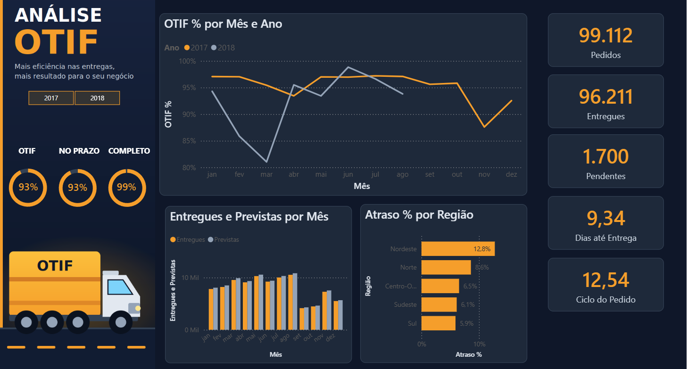

# Análise OTIF | Python + SQL Server + Power BI

Projeto de análise de desempenho logístico com o dataset público de e-commerce da Olist. O foco é acompanhar **pontualidade e nível de serviço das entregas** (OTIF: *On Time In Full*), do tratamento dos dados até o dashboard.

## O que o projeto responde

- Qual é o OTIF geral, e como ele varia mês a mês (2017 x 2018)?
- Quantos pedidos foram entregues, quantos estão pendentes?
- Quanto tempo leva, em média, da compra até a entrega?
- Quais regiões concentram mais atrasos?

## Estrutura do repositório

| Arquivo | Descrição |
|---|---|
| `etl_logistica.py` | ETL em Python (pandas + SQLAlchemy) que trata os dados de entrega e grava a tabela fato no SQL Server |
| `conexao.py` | Teste de conexão com o SQL Server |
| `dashboard_otif_olist.pbix` | Dashboard em Power BI |
| `dashboard_otif.png` | Imagem do dashboard |

## Etapas

### 1. ETL com Python e SQL Server
O script `etl_logistica.py` lê as tabelas de pedidos e itens direto do SQL Server e:
- filtra somente pedidos entregues;
- calcula os dias de atraso (entrega real x data estimada) e classifica cada entrega como **No Prazo** ou **Atrasado**;
- calcula o tempo de entrega, da compra até o cliente;
- agrega frete, valor dos produtos e quantidade de itens por pedido;
- grava a tabela fato `fato_entregas` de volta no SQL Server.

### 2. Dashboard OTIF no Power BI
O dashboard foi montado sobre os CSVs do Olist, com tratamento no **Power Query** e medidas em **DAX**:
- **Colunas criadas no Power Query:** região (a partir do estado do cliente), `no_prazo`, `completo`, `otif`, `dias_ate_entrega` e `ciclo_pedido`.
- **Medidas DAX:** OTIF %, No Prazo %, Completo %, Pedidos, Entregues, Pendentes, Atraso %, Dias até Entrega e Ciclo do Pedido.
- **Visuais:** OTIF por mês e ano, entregues x previstas por mês, atraso por região, cartões de KPI e segmentação por ano.
- **Design:** tema escuro com destaque laranja e fundo criado à parte.

## Regras de cálculo

- **No Prazo:** pedido entregue até a data estimada de entrega (comparação apenas pela data).
- **Completo:** o Olist não traz quantidade pedida x entregue, então esse indicador foi **simulado**: pedidos com status `canceled` ou `unavailable` contam como incompletos.
- **OTIF:** pedido entregue no prazo **e** completo.
- Pedidos ainda sem entrega ficam fora do cálculo de pontualidade.

> **Limitação:** como pedidos cancelados ou indisponíveis quase nunca têm data de entrega, o OTIF fica praticamente igual ao No Prazo. Com dados reais de quantidade pedida x entregue, o "Completo" passaria a pesar no resultado.

## Principais achados

- OTIF geral de aproximadamente **93%**.
- **Nordeste** com o maior índice de atraso (cerca de 12,8%).
- Quedas de OTIF em **novembro de 2017** (cerca de 88%) e **março de 2018** (cerca de 81%).

## Dataset

[Brazilian E-Commerce Public Dataset by Olist](https://www.kaggle.com/datasets/olistbr/brazilian-ecommerce) (Kaggle). Os CSVs não estão neste repositório: baixe no link acima.

## Ferramentas

Python (pandas, SQLAlchemy) · SQL Server · Power Query · DAX · Power BI

## Autor

Daniel
